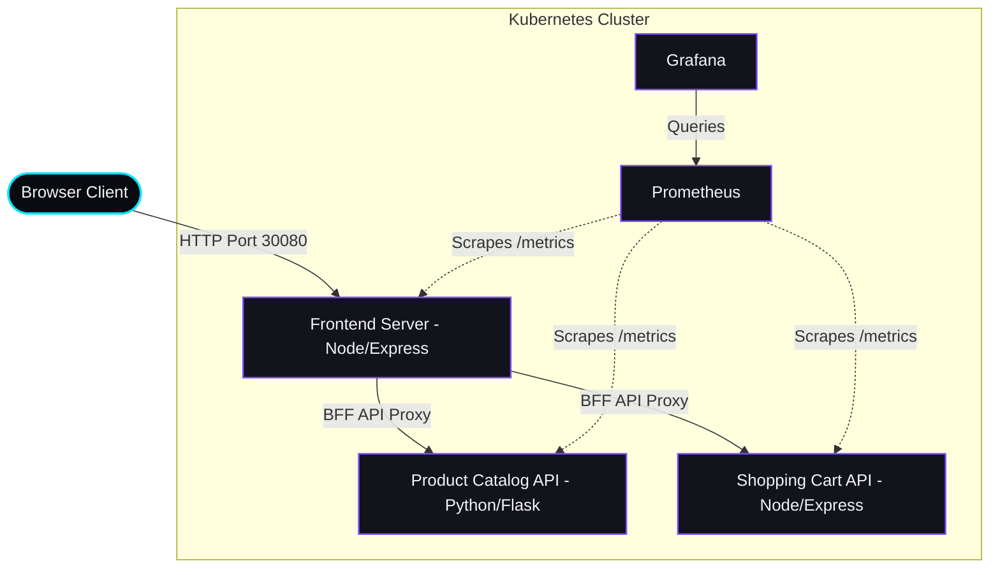

# Mini E-Commerce DevOps Microservices System

A professional, containerized 3-microservice e-commerce application equipped with an automated CI/CD pipeline, Kubernetes deployment manifests, and Prometheus/Grafana monitoring.

This project demonstrates a production-grade DevOps workflow featuring a backend-for-frontend (BFF) pattern, microservice isolation, unit testing gates, and configuration externalization.

## DevOps Workflow Notes

- Docker Compose is used for local multi-service validation before CI runs.
- GitHub Actions runs unit tests before image build and deployment stages.
- Kubernetes manifests under `k8s/` define service exposure, workloads, autoscaling, and monitoring resources.

---

## 🏗️ Architecture Overview



### 1. Components
- **Frontend Server (Port 5000)**: Serves a premium Dark Mode Single Page Application (SPA) designed with glassmorphism elements, micro-animations, filters, and dynamic search. Acts as a BFF (Backend-For-Frontend) proxying requests to internal microservices.
- **Product Catalog API (Port 5001)**: Flask application written in Python returning curated products from an in-memory database.
- **Shopping Cart API (Port 5002)**: Node.js Express application managing active customer shopping carts.
- **Prometheus (Port 9090)**: Collects HTTP request statistics and durations across all services.
- **Grafana (Port 3000)**: visualizes API traffic, error rates, and resource utilization.

---

## 📂 Project Directory Structure

```text
├── .github/
│   └── workflows/
│       └── ci-cd.yml          # GitHub Actions pipeline definitions
├── frontend/
│   ├── public/                # Static assets (HTML, CSS with HSL layout, JS logic)
│   ├── server.js              # Express BFF web server
│   ├── package.json           
│   ├── Dockerfile             # Multistage Node.js alpine containerization
│   └── test_frontend.js       # Jest/Supertest suite for BFF
├── product-catalog/
│   ├── app.py                 # Flask server with Prometheus Client
│   ├── requirements.txt       
│   ├── Dockerfile             # python:3.11-slim containerization
│   └── test_app.py            # PyTest suite for Catalog endpoints
├── shopping-cart/
│   ├── server.js              # Express endpoint & in-memory cart store
│   ├── package.json           
│   ├── Dockerfile             
│   └── test_server.js         # Jest/Supertest suite for Cart API
├── k8s/
│   ├── product-catalog.yaml   # Deployment & ClusterIP Service
│   ├── shopping-cart.yaml     # Deployment & ClusterIP Service
│   ├── frontend.yaml          # ConfigMap, Deployment & NodePort Service
│   └── monitoring.yaml        # Prometheus/Grafana Deployments & NodePorts
├── prometheus/
│   └── prometheus.yml         # Scrape target config for docker-compose
├── docker-compose.yml         # Local unified container configuration
└── README.md                  # System instruction handbook
```

---

## 🧪 Running Unit Tests

Any unit test failure blocks deployment in the CI/CD pipeline. Test locally using these commands:

### 1. Test Product Catalog (Python)
Ensure Python 3.8+ is installed:
```bash
cd product-catalog
pip install -r requirements.txt
python -m pytest
```

### 2. Test Shopping Cart (Node.js)
Ensure Node.js 18+ is installed:
```bash
cd shopping-cart
npm install
npm test
```

### 3. Test Frontend Server (Node.js)
```bash
cd frontend
npm install
npm test
```

---

## 🐳 Running Locally via Docker Compose

Run the entire application ecosystem, including monitoring, with a single command:

1. Start all containers:
   ```bash
   docker-compose up --build
   ```

2. Once spun up, access the following:
   - **Frontend App**: [http://localhost:5000](http://localhost:5000)
   - **Product Catalog API**: [http://localhost:5001/products](http://localhost:5001/products)
   - **Shopping Cart API**: [http://localhost:5002/cart](http://localhost:5002/cart)
   - **Prometheus Dashboard**: [http://localhost:9090](http://localhost:9090)
   - **Grafana Dashboard**: [http://localhost:3003](http://localhost:3003) (Login: `admin` / Password: `admin`)

---

## ☸️ Kubernetes Deployment

Deploy to Kubernetes (Minikube / Kind / MicroK8s):

1. Start your local cluster (e.g., Minikube):
   ```bash
   minikube start
   ```

2. Point your terminal to use Minikube's Docker daemon (optional, to use local builds):
   ```bash
   minikube docker-env | Invoke-Expression
   ```

3. Build the container images inside Minikube's Docker daemon:
   ```bash
   docker build -t peakyecommerce/product-catalog:latest ./product-catalog
   docker build -t peakyecommerce/shopping-cart:latest ./shopping-cart
   docker build -t peakyecommerce/frontend:latest ./frontend
   ```

4. Apply all manifests in the `k8s/` folder:
   ```bash
   kubectl apply -f k8s/
   ```

5. Retrieve Minikube service IPs to access the services:
   ```bash
   # Open Frontend in browser
   minikube service frontend-service
   
   # Open Prometheus Dashboard
   minikube service prometheus-service
   
   # Open Grafana
   minikube service grafana-service
   ```
   *If not using Minikube, access them at your node IP on NodePorts `30080` (Frontend), `30090` (Prometheus), and `30030` (Grafana).*

---

## 📈 Prometheus Metric Collection & Custom Metrics

All microservices scrape metrics from the `/metrics` endpoint. The custom metrics collected are:

- **Product Catalog**:
  - `product_catalog_requests_total` (Labels: `method`, `endpoint`, `status_code`): Counter
  - `product_catalog_request_duration_seconds` (Labels: `method`, `endpoint`): Histogram
- **Shopping Cart**:
  - `shopping_cart_requests_total` (Labels: `method`, `route`, `status_code`): Counter
  - `shopping_cart_request_duration_seconds` (Labels: `method`, `route`): Histogram
- **Frontend**:
  - `frontend_requests_total` (Labels: `method`, `route`, `status_code`): Counter
  - `frontend_request_duration_seconds` (Labels: `method`, `route`): Histogram

### Creating a Grafana Dashboard:
1. Log in to Grafana (`admin` / `admin`).
2. Go to **Connections > Data Sources > Add Data Source**, select **Prometheus**.
3. Set URL to `http://prometheus-service:9090` and click **Save & Test**.
4. Create a new Dashboard and add panels using PromQL queries, such as:
   - **Request Rate**: `sum(rate(frontend_requests_total[1m])) by (status_code)`
   - **Average Response Latency**: `sum(rate(shopping_cart_request_duration_seconds_sum[5m])) / sum(rate(shopping_cart_request_duration_seconds_count[5m]))`

---

## 🚀 GitHub Actions CI/CD Pipeline

The workflow defined in `.github/workflows/ci-cd.yml` automates the testing, building, and deployment cycles:

1. **Test Gate**: Runs Python pytest and Node.js jest test suites. If any test fails, execution stops immediately, blocking deployment.
2. **Build and Push**: Runs on merge to `main`/`master`. Builds Docker images and pushes them to your Docker Registry (requires `DOCKERHUB_USERNAME` and `DOCKERHUB_TOKEN` repository secrets).
3. **Deploy**: Authenticates to your Kubernetes cluster (using `KUBE_CONFIG` secret), performs dry-run validations on manifests, applies deployment changes, and performs a rolling restart to roll out fresh image tags.
# E-Commerce-Pipeline
